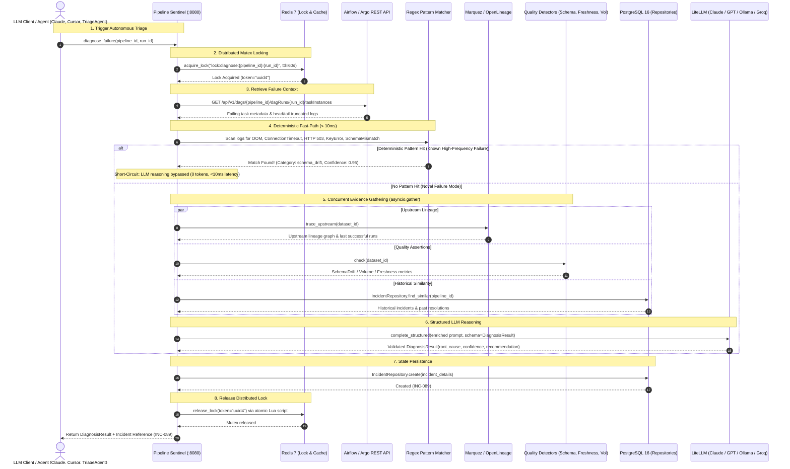

# DataGuard Agent

**Pipeline Sentinel** — an MCP-native AI agent that monitors data pipelines, traces failures to root cause, and files structured incidents. Built for data engineers who want LLM-driven triage without vendor lock-in.

---

```
$ claude "Check all pipeline statuses and diagnose any failures in the last 6 hours"

● list_pipelines → 12 pipelines, 2 degraded, 1 failed
● get_failure_details → customer_ltv_daily: KeyError on column 'account_type'
● trace_lineage → upstream: crm_accounts last succeeded 14h ago
● diagnose_failure →
    root_cause: schema_drift (confidence: 0.94)
    evidence: crm_accounts dropped column 'account_type' at 2024-01-15T03:12Z
    similar_incidents: [INC-047 resolved by schema backfill, 2023-11-02]
    recommended_action: backfill column or update downstream SELECT list
● file_incident → INC-089 created
```

*[full asciinema recording — placeholder URL]*

---

## Quick Start

**Requirements:** Docker, Docker Compose v2, and an MCP client (Claude Desktop, Cursor, or the CLI).

```bash
git clone https://github.com/dataguard-agent/dataguard-agent
cd dataguard-agent
make demo
```

This starts Airflow (with intentionally failing DAGs), Postgres, Redis, Marquez, Prometheus, and the Sentinel MCP server. Demo data is seeded automatically.

**Claude Desktop config** (`~/Library/Application Support/Claude/claude_desktop_config.json`):

```json
{
  "mcpServers": {
    "pipeline-sentinel": {
      "command": "docker",
      "args": ["exec", "-i", "dataguard-sentinel", "pipeline-sentinel", "mcp"]
    }
  }
}
```

See [examples/claude-desktop-config.json](examples/claude-desktop-config.json) for all client configs.

---

## MCP Tools

| Tool | Description |
|------|-------------|
| `list_pipelines` | All pipelines with status, SLA compliance, orchestrator |
| `get_pipeline_status` | Run history, duration trends, upstream/downstream graph |
| `get_failure_details` | Full error context: stack trace, log excerpt, retry history |
| `trace_lineage` | Traverse OpenLineage graph up/downstream to configurable depth |
| `diagnose_failure` | Root cause with confidence score, evidence, and historical matches |
| `propose_remediation` | Ordered remediation plan with risk level and rollback |
| `check_data_quality` | Schema drift, volume anomaly, freshness checks per dataset |
| `get_recent_incidents` | Incident history filtered by time window, severity, status |
| `file_incident` | Create incident record; optionally push to Jira/PagerDuty/GitHub |
| `execute_remediation` | **Opt-in only.** Executes approved plans; full audit trail |

Full schema reference: [docs/mcp-tools.md](docs/mcp-tools.md)

---

## Architecture

```
LLM Client (Claude, Cursor, GPT, etc.)
        │  MCP Protocol
        ▼
┌─────────────────────────────────────┐
│     dataguard-agents (Runtime)      │
│  (TriageAgent, Watchdog, Reports)   │
└──────────────────┬──────────────────┘
                   ▼
┌─────────────────────────────────────┐
│     Pipeline Sentinel MCP Server    │
│  (packages/sentinel: Tools, FastMCP)│
└──────────┬──────────────────────────┘
           │
  ┌────────┼──────────────┐
  ▼        ▼              ▼
Adapters  Detectors    Lineage
(Airflow  (Schema,     (OpenLineage
 Argo,     Volume,      / Marquez)
 Registry) Freshness)
  │
  └─── dataguard-core (LLM via litellm, Postgres Repositories, Redis Locks, OTel)
```

See [ARCHITECTURE.md](ARCHITECTURE.md) for design rationale and request lifecycle.

---

## Live Action Flow: How It Works

The following sequence diagram shows the real-time execution flow when an agent or user invokes `diagnose_failure`:



---

## Deployment

DataGuard Agent supports multiple open-source deployment topologies:
- **Local Evaluation:** `make demo` (Airflow, Postgres, Redis, Marquez, Prometheus, Grafana)
- **Production Kubernetes:** Helm chart at `deploy/helm/dataguard-sentinel/`
- **GitOps Continuous Delivery:** ArgoCD Application manifest at `deploy/argocd/application.yaml`

See the complete [Open-Source Deployment Guide](docs/deployment.md).

---

## vs. Existing Tools

| | Pipeline Sentinel | Monte Carlo | Datafold | Bigeye |
|---|---|---|---|---|
| Open source | ✓ | ✗ | ✗ | ✗ |
| MCP-native | ✓ | ✗ | ✗ | ✗ |
| Self-hosted | ✓ | ✗ | Partial | ✗ |
| Agent-driven triage | ✓ | Partial | ✗ | ✗ |
| Lineage integration | OpenLineage | Proprietary | dbt | Limited |
| Orchestrator support | Airflow, Argo | Airflow, dbt | dbt | Airflow |

---

## Why We Built This

Data engineers spend most of their week firefighting broken pipelines. Existing observability tools are expensive, closed-source, and built for dashboards — not for AI agents. Pipeline Sentinel closes that gap: MCP-native from day one, fully self-hosted, and designed to plug into any LLM workflow that supports the Model Context Protocol.

---

## Status

**v0.1 — active development.** Airflow and Argo adapters functional. Dagster and Prefect stubs only. See [ROADMAP.md](ROADMAP.md).

## Contributing

See [CONTRIBUTING.md](CONTRIBUTING.md).

## License

Apache 2.0 — see [LICENSE](LICENSE).
